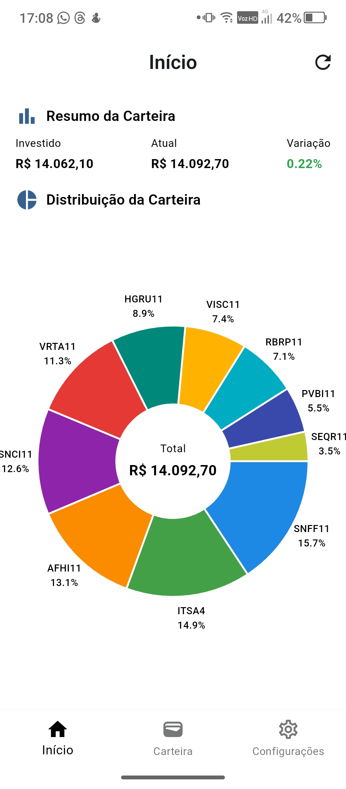
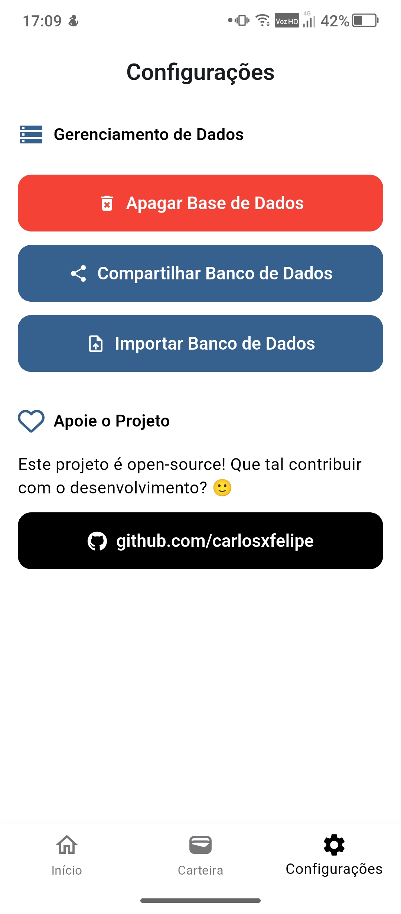
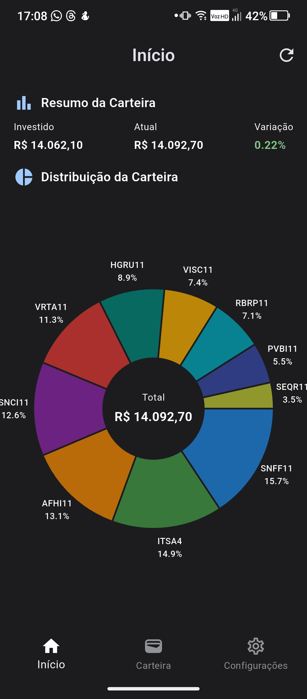
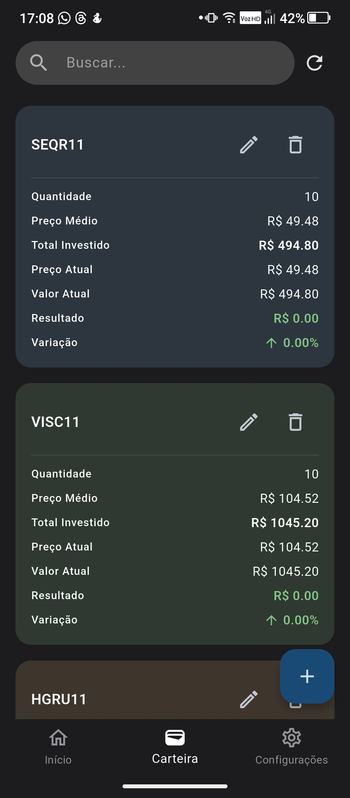
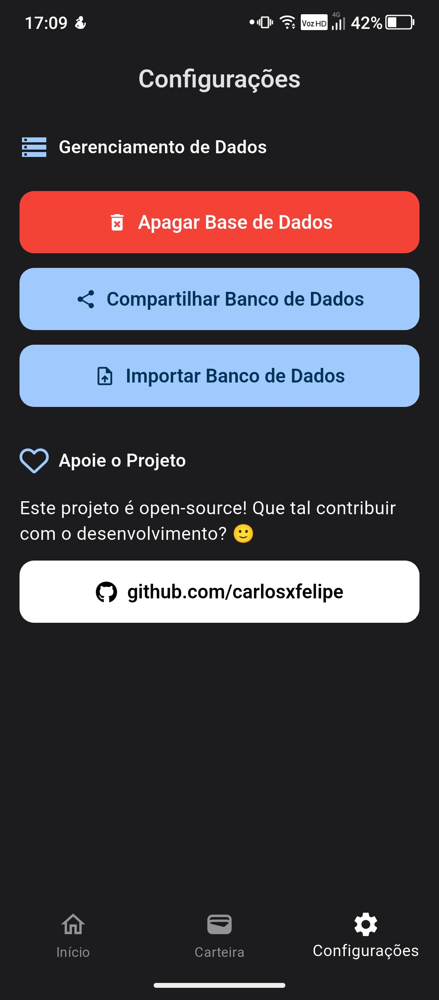

# 📈 Ticker

**Ticker** é um aplicativo Flutter para gerenciamento de ativos financeiros. Com ele, é possível registrar investimentos, acompanhar a evolução da carteira e visualizar gráficos de distribuição. Os dados são armazenados localmente, com suporte para backup e importação do banco de dados.

<p align="center">
  <table>
    <tr>
      <td></td>
      <td></td>
      <td></td>
    </tr>
  </table>
</p>

<p align="center">
  <table>
    <tr>
      <td></td>
      <td></td>
      <td></td>
    </tr>
  </table>
</p>

## 🚀 Funcionalidades

- 📊 Visualização de resumo da carteira (valor investido, valor atual e variação);
- 🧩 Gráfico de pizza para distribuição dos ativos;
- 💾 Armazenamento local com SQLite;
- 📂 Backup e restauração do banco de dados;
- 🔄 Atualização automática dos preços via API [Brapi.dev](https://brapi.dev);
- 🌙 Suporte a temas claro e escuro;
- 🔐 Variáveis sensíveis (.env) para chaves de API;
- 🔀 Navegação com GoRouter;
- 🇧🇷 Formatação e idioma em português do Brasil (pt_BR).

## 🧪 Como Rodar

1. **Clone o repositório:**

   ```bash
   git clone https://github.com/carlosxfelipe/ticker.git
   cd ticker
   ```

2. **Configure o arquivo `.env`:**

   Crie um arquivo `.env` na raiz do projeto com sua chave da API:

   ```
   BRAPI_API_KEY=sua-chave-aqui
   ```

3. **Instale as dependências:**

   ```bash
   flutter pub get
   ```

4. **Execute o app:**

   ```bash
   flutter run
   ```

## 🔒 Licença

Este projeto é licenciado sob os termos da **GNU General Public License v3.0 or later**.

Você pode ver a licença completa em [`LICENSE`](./LICENSE) ou acessá-la diretamente [aqui](https://www.gnu.org/licenses/gpl-3.0.txt).

---

> Projeto desenvolvido com ❤️ por [@carlosxfelipe](https://github.com/carlosxfelipe). Contribuições são bem-vindas!
